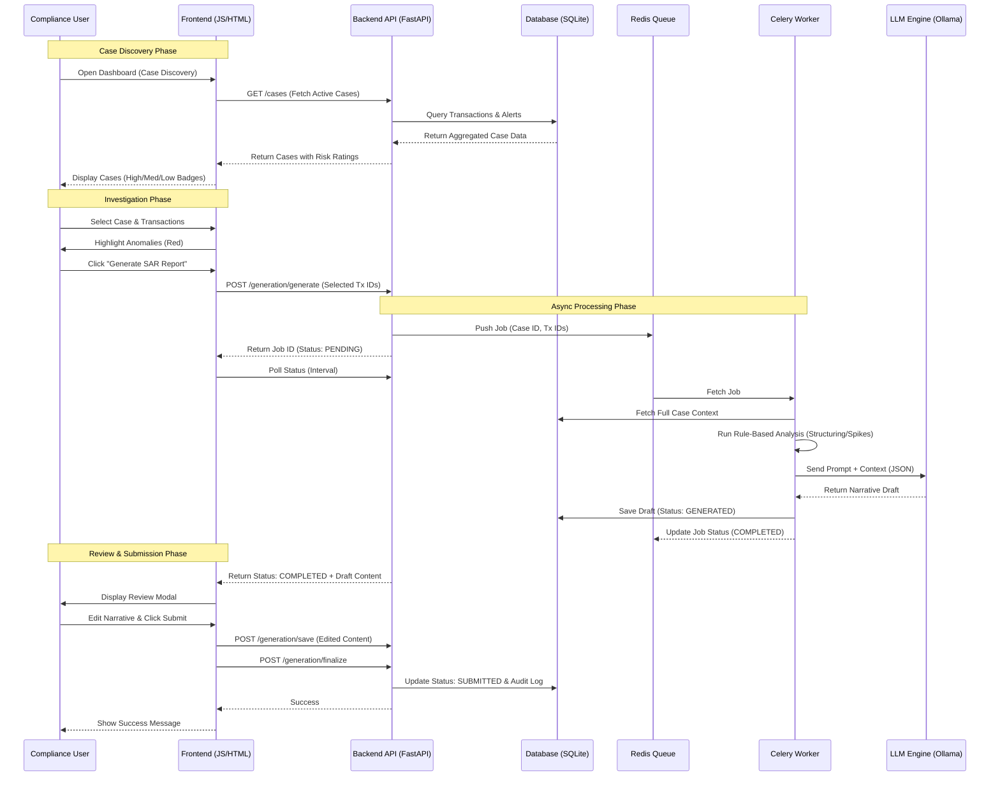

# SAR Generation System - Architecture & Workflow

## 1. Workflow Diagram (Mermaid)

## 2. Architecture Diagram Prompt

You can use the following prompt with any AI image generator (like ChatGPT/DALL-E 3, Midjourney) or diagramming tool to visualize the entire system architecture.

**Copy and Paste this Prompt:**

> **Subject:** Technical Architecture Diagram for an AI-Powered SAR (Suspicious Activity Report) Generation System.
> 
> **Style:** High-level system architecture diagram, clean, modern, professional, cloud-native aesthetic. Use distinct icons for different technologies.
> 
> **Components to Include:**
> 1.  **Frontend Layer (User Interface):**
>     *   **"Compliance Dashboard"**: A web interface (HTML/JS) showing "Case Discovery" and "Report Editor".
>     *   **Action Arrow**: User selects transactions -> Sends request to Backend.
> 
> 2.  **API Layer (Backend):**
>     *   **"FastAPI Server"**: The central orchestrator handling REST API requests.
>     *   **Features/Modules inside API**: 
>         *   "Risk Engine" (Calculates High/Med/Low risk).
>         *   "Anomaly Detector" (Statistical spike detection).
>         *   "Auth & Rate Limiting".
> 
> 3.  **Data Layer (Persistence):**
>     *   **"SQLite / PostgreSQL Database"**: Stores "Transactions", "Alerts", "Customer Profiles", and "SAR History".
>     *   **"Seed Data"**: Show an input arrow representing "Mock High-Risk/Low-Risk Scenarios".
> 
> 4.  **Async Processing Layer (The "Brain"):**
>     *   **"Redis Queue"**: Buffers generation requests from the API.
>     *   **"Celery Worker"**: Consumes tasks from Redis. Performs deep analysis.
>     *   **"Analysis Engine"**: A component inside the worker that runs rule-based logic (e.g., "Structuring Check").
> 
> 5.  **AI Engine (The Generator):**
>     *   **"Ollama (Local LLM)"**: Represents the AI model (Llama 3).
>     *   **Flow**: Celery Worker sends "Prompt + Context" -> Ollama returns "Narrative Draft".
> 
> **Data Flow Arrows:**
> *   **User** -> **Frontend** -> **FastAPI**
> *   **FastAPI** <-> **Database** (Reads Cases / Saves Reports)
> *   **FastAPI** -> **Redis** -> **Celery Worker**
> *   **Celery Worker** <-> **Ollama** (Generation Loop)
> *   **Celery Worker** -> **Database** (Saves Generated Draft)
> 
> **Key Labels/Annotations:**
> *   "Dynamic Risk Scoring" (near API/Database)
> *   "Context-Aware Generation" (near Ollama)
> *   "Audit Trail" (near Database/History)
> *   "Local Execution" (emphasize data privacy)
